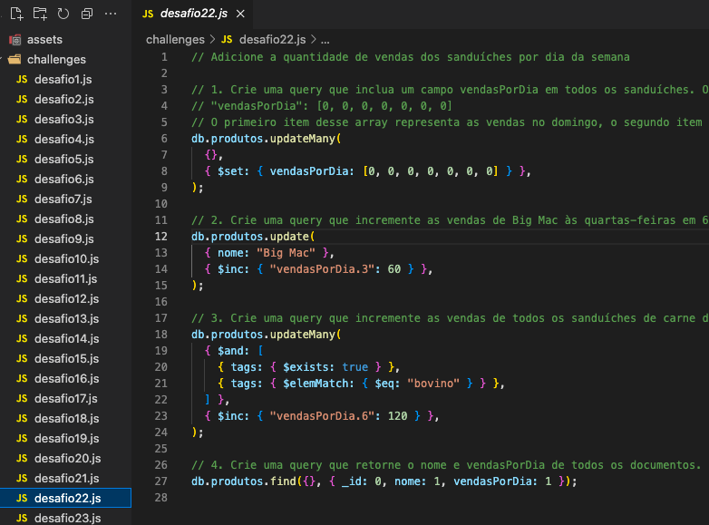

<!-- PROJECT LOGO -->
<br />
<p align="center">
    
  
  <p align="center" style="color:#8FBC8B; font-size:25px">
    MongoDB - commerce 
    <br />
  </p>
</p>
<br>

<!-- Sobre o projeto -->
# Sobre o projeto
<div style="font-size:16px">

Projeto desenvolvido durante o curso da Trybe no módulo de back-end, com o intuito de estudar e praticar `MongoDB`.
<br>

Tratam-se de queries que realizam diversas ações no banco de dados `commerce`, que contém informações do cardápio do McDonald's, como ingredientes, valores nutricionais e dados fictícios de vendas.
<br>

O projeto contém 32 arquivos dentro da pasta `/challenges` com descrição do que será feito no banco de dados, bem como sua devida query.

<br>

# Rodando localmente

### Pré-requisitos:

* Docker ou MongoDB instalados.

<br>

### Rodando o projeto com docker:
1. Clone o repositório em uma pasta de seu computador:
```sh
git clone git@github.com:mathlaza/mongodb-commerce.git
```
2. Entre na pasta raiz do projeto:
```sh
cd mongodb-commerce
```
3. Crie um container com um volume apontando para a pasta do projeto:
```sh
docker run -d --name=nomeDoContainer -v "$PWD:/app" -p 27017:27017 mongo:5.0
```
4. Com o container em execução, acesse o terminal do container:
```sh
docker exec -it nomeDoContainer bash
```
5. Execute "mongo" e entre na shell do mongo. Execute "use commerce" para mudar para o banco `commerce`. Com isso, basta copiar e colar as queries do projeto no shell aberto para observar o que cada uma faz!
<br>

* Para restaurar o banco de dados, basta inserir no terminal do container (passo 4) o comando: 
```sh
DBNAME=commerce ./scripts/resetdb.sh assets/produtos
```
* Para sair do shell do mongo e do terminal do container, basta executar "exit".